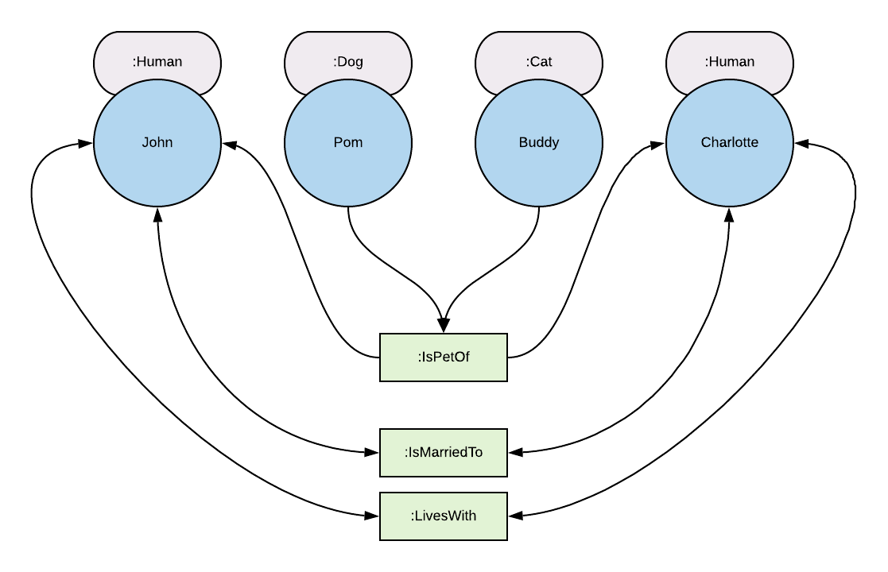

# ERM
ERM : Entity Relationship Manager

Graph-based data model to manage entities (nodes) and their relationships (edges) with the following features:
* Support for different storage providers (e.g. elasticsearch)
* RESTful & GraphQL APIs
* Strongly typed field definitions and localizable property values.

## Setup

1. Run elasticsearch locally (using http://localhost:9200) or change Vouzamo.ERM.Api > Startup.js for alternative options / providers.
2. Build & run the Vouzamo.ERM.Api project.
3. Use Graph*i*QL (/graphiql) to interact with GraphQL.

## Getting Started

Lets use an example to explain how to produce a data model:



### Creating the NodeType(s)

Using Graph*i*QL, run the following mutation:

```javascript
mutation CreateHumanNodeType {
  createNodeType(name: "Human") {
    id
  }
}
```
